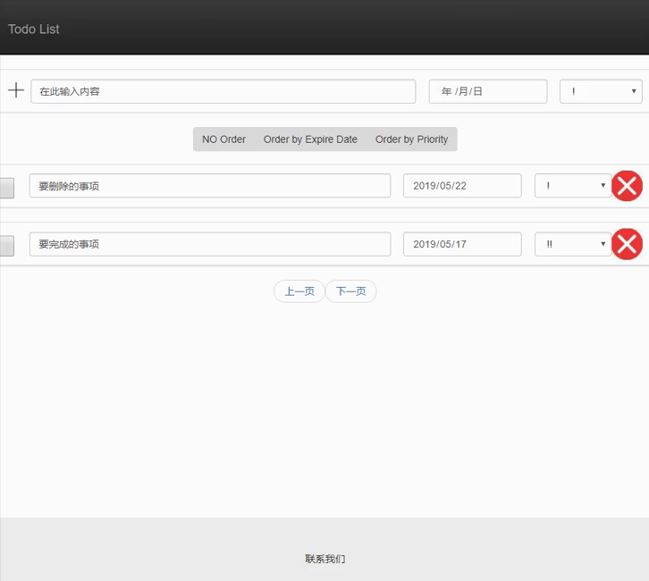

# Todo-List
Django + Django Rest Framework

## 一、实现的功能列表 
>> -增加一个待办事项 
>>  -删除一个待办事项 
>>  -标记一个待办事项为已完成 
>> -编辑一个待办事项的具体内容 
>>  -列出所有的待办事情 
>>  -列表界面支持翻页 
>>  -待办事项可以设置优先级 
>>  -待办事项可以设置expire date 
>>  -支持按照不同的方式排序，如优先级，expire date 
  ## 二、功能截图 
>> -增加一个待办事项 
>>   
>>  -删除一个待办事项 
>>  
>>  -标记一个待办事项为已完成 
>>  
>> -编辑一个待办事项的具体内容 
>>  
>>  -列出所有的待办事情 
>>  
>>  -列表界面支持翻页 
>>  
>>  -待办事项可以设置优先级 
>>  
>>  -待办事项可以设置expire date 
>>  
>>  -支持按照不同的方式排序，如优先级，expire date 
>>  
